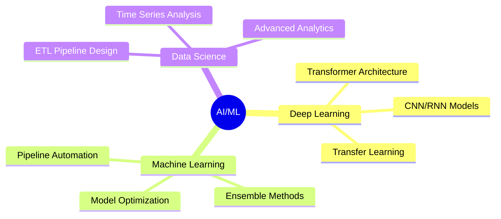

# <div align="center">⚡ Roshan Roy Suja ⚡</div>

<div align="center">
  
[](https://www.linkedin.com/in/roshan-r-s/)
[](mailto:2001roshanrs@gmail.com)
[](https://github.com/yourusername)

</div>

## <div align="center">🎓 MS in Computer Science @ Cal State LA</div>

<div align="center">

```ascii
                    AI/ML Engineer | Data Scientist | Computer Vision Specialist
```

Passionate about transforming complex data challenges into elegant AI solutions, I thrive on pushing the boundaries of machine learning and computer vision to create real-world impact. My journey spans from developing smart waste classification systems to earthquake prediction models, always driven by the belief that AI can revolutionize how we solve tomorrow's problems.

</div>

---

<div align="center">

### 🛠️ Tech Arsenal

[]()
[]()
[]()
[]()
[]()
[]()
[]()
[]()
[]()

</div>

---

<div align="center">
  
### 🏆 Achievements Showcase
  
```ascii
🥈 TRIAS Hackathon Runner-up
🥇 Smart Rural Community Hackathon Winner
📚 GUVI AI Workshop Guinness World Record
```

</div>

---

<div align="center">

### 🌟 Core Competencies



</div>

---

<div align="center">

### 📫 Get in Touch

```ascii
Location: Los Angeles, CA
Email: 2001roshanrs@gmail.com
```

*Currently seeking opportunities in Machine Learning, Data Science, and AI*

</div>
